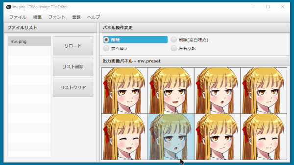

TKool Image Tile Editor マニュアル
================================================================================

- バージョン       : 1.0.0
- 作者             : 次郎 (Jiro)
- 作成日           : 2017/03/07
- 最終更新日       : 2017/03/07
- 連絡先           : [次ログ](http://jiroron666.hatenablog.com/)
- 実行ファイル名   : tkite.jar
- 動作確認・開発環境
  - OS             : Windows10 Pro 64bit
  - プロセッサ     : 2.00GHz Intel Core i7-3667U
  - メモリ         : 8GB RAM
  - Javaバージョン : 1.8.0-121

目次
--------------------------------------------------------------------------------

1. [ソフトウェア概要                 ] (#ソフトウェア概要             )
1. [ファイル構成                     ] (#ファイル構成                 )
1. [動作条件                         ] (#動作条件                     )
1. [実行方法                         ] (#実行方法                     )
1. [使い方                           ] (#使い方                       )
  1. [ファイルを開く                 ] (#ファイルを開く               )
  1. [画像の確認                     ] (#画像の確認                   )
  1. [編集モードの確認               ] (#編集モードの確認             )
  1. [画像の編集                     ] (#画像の編集                   )
  1. [画像の保存                     ] (#画像の保存                   )
  1. [画像の確認                     ] (#画像の確認                   )
1. [複数画像の連結                   ] (#複数画像の連結               )
  1. [連結ファイルの選択             ] (#連結ファイルの選択           )
1. [画像規格プリセット               ] (#画像規格プリセット           )
  1. [新規プリセット                 ] (#新規プリセット               )
  1. [プリセットを開く               ] (#プリセットを開く             )
  1. [プリセットの編集               ] (#プリセットの編集             )
    1. [プリセット編集画面の操作方法 ] (#プリセット編集画面の操作方法 )
    1. [行列からサイズを設定         ] (#行列からサイズを設定         )
    1. [サイズから行列を設定         ] (#サイズから行列を設定         )
1. [ショートカットキー               ] (#ショートカットキー           )
1. [FAQ                              ] (#FAQ                          )
1. [利用規約                         ] (#利用規約                     )
  1. [補足                           ] (#補足                         )
1. [バージョンアップ方法             ] (#バージョンアップ方法         )
1. [その他・作者からのお願い         ] (#その他・作者からのお願い     )
1. [アンインストール方法             ] (#アンインストール方法         )
1. [更新履歴                         ] (#更新履歴                     )

ソフトウェア概要
--------------------------------------------------------------------------------

このソフトは、タイル画像ファイルを簡単に編集するためのツールです。

本ソフトでは以下のような処理が可能です。

- 画像タイルの1タイル単位での削除、移動画像タイルの1タイル単位での削除後の画像詰
- 画像タイルの1タイル単位での削除後の画像詰め
- 画像タイルの左右反転
- 複数画像タイルの連結
- ツクール以外の独自画像規格の追加

また、本ソフトはJava言語のみを利用してマルチプラットフォームを意識して作成しまし
た。

Mac環境では未確認ですが、Windows, Mac, LinuxといったメジャーなOSであればどの環境
でも動作するはずです。

ファイル構成
--------------------------------------------------------------------------------

zip配布時の構成

- README.html          : READMEへのリンク
- java_download.html   : Javaアップデート公式サイトへのリンク
- tkite.jar            : 実行ファイル

初回起動時に生成されるフォルダ (各種ファイルの保存・管理用)

- log        : 最近開いたファイルログ
- presets    : 画像規格ファイル
- properties : 設定ファイル

上記の生成されるフォルダ類は、アンインストールする時以外に場所を移動したり、削除
したりしないようにしてください。予期せぬ動作の原因になります。

動作条件
--------------------------------------------------------------------------------

本ソフトを実行するにはJavaがインストールされている必要があります。また、本ソフト
作成時のJavaのバージョン以上がインストーされている必要があります。

もし本ソフトをダブルクリックで実行できなかった場合は、Webブラウザで下記URLの公式
サイトを開くか、同封の java_download.html をダブルクリックして公式サイトを開いて
Javaをインストールまたはアップデートしてください。

[Javaダウンロード] (https://java.com)

それでも起動できなかった場合は、お手数ですがFAQの項目を確認した後に、本ドキュメ
ント先頭の連絡先より作者にご報告ください。

実行方法
--------------------------------------------------------------------------------

"tkite.jar"をダブルクリックしてください。LinuxOSをご使用の方はターミナルから
"java -jar tkite.jar"と打ち込んでください。

使い方
--------------------------------------------------------------------------------

### ファイルを開く

ファイルメニューの"開く"を選択して、編集したい画像ファイルを選択したください。

### 画像の確認

ウィンドウ左側のファイルリストに画像ファイルが追加されたことを確認してください。
この時、同時に画面右側の画像出力パネルに画像が表示されていれば、正常に動作してい
ます。

もしこの時、画像出力パネルに画像が表示されていなければ、読み込んだ画像の規格と編
集するための画像の規格が異なっている可能性があります。

その場合は、ファイルメニューから"プリセットを開く"を選択して、画像の規格を変更し
てください。

デフォルトで生成される画像規格プリセットは以下の通りです。

- mv.preset      : RPGツクールMV    の顔画像タイル用
- vxace.preset   : RPGツクールVXACE の顔画像タイル用
- iconset.preset : RPGツクールMV    のアイコン画像タイル用

また、これらのプリセット以外の独自規格を新たに追加することも可能です。プリセット
追加についての詳細は[画像規格プリセット](#画像規格プリセット)の項目を参照してく
ださい。

### 編集モードの変更

編集したい画像が出力画像パネルに表示されたら、パネル操作変更のパネルから操作した
いモードを選択してください。これは出力画像パネルをマウスでクリックした時の動作を
変更します。

各種パネルのモードは以下のとおりです。

- 削除モード
    クリックしたパネルの画像を空(透明色のみ)にします。

- 削除モード(空白埋め)
    クリックしたパネルの画像を削除し、クリックした画像以降の画像を移動して空白を
    詰めます。一番末尾の画像には空の画像が挿入されます。

- 並べ替えモード
    2つ画像をクリックすると、クリックされた画像の位置が交換されます。

- 左右反転モード
    クリックした画像を左右反転します。

### 画像の編集

出力画像パネルをマウスクリックして編集してください。操作変更パネルのモードの動作
をクリックしたパネルに適用します。

編集した画像を最初の状態に復元したい場合は、ファイルリストのリロードボタンを選択
してください。選択中の画像を出力画像パネルに表示し直します。

注意点として、本ソフトでは「元に戻す・やり直す」といった機能は実装していません。
編集を誤ったと思ったときはリロードボタンを押して編集前の最初の状態に戻すことしか
できません。

### 画像の保存

ファイルメニューから保存、または名前をつけて保存を選択してください。

ただし、この操作を行うとリロードボタンを押しても画像を編集前に戻すことはできなく
なります。

### 画像の確認

エクスプローラで画像をダブルクリックして画像を正常に保存されていることを確認して
ください。

もしこの時、出力画像パネルの表示と異なる画像が表示されいた場合は、連絡先から製作
者ブログにバグ報告していただけると助かります。

複数画像の連結
--------------------------------------------------------------------------------

RPGツクールの標準で利用可能な画像は行列2×4の8枚の画像によって構成されています。

しかし、画像の横幅を維持していれば、縦幅を拡大した画像でも読み込んで正常に使用す
ることが可能です。

この仕様を利用すれば、複数の画像を1枚の画像タイルにまとめることができます。また
は、同じアクターの異なる表情差分ファイルを1枚の画像ファイルにまとめて管理するこ
とが可能です。

本ソフトではこういった用途でも利用できるように、ファイルの連結機能を実装していま
す。

### 連結ファイルの選択

連結したいファイルを選択します。

連結するファイルは選択したファイルの先頭のファイルの画像サイズを基準にフィルタリ
ングします。よって、画像サイズの異なるファイルも同時に開いた場合、先頭のファイル
と画像のサイズが異なっていた場合は除外されます。

連結する画像の選択が完了したら、次に連結した画像を取り扱うためのプリセットを生成
します。プリセットの保存ダイアログにしたがって、保存するプリセットの名前を入力し
てください。

プリセットの名前が決定したら、プリセットの編集を行います。詳細は[プリセットの編
集](#プリセットの編集)の項目を参照してください。

画像規格のプリセット
--------------------------------------------------------------------------------

本ソフトではTKoolとタイトルに銘打っているとおり、RPGツクールシリーズのタイル画像
を編集するためのものです。

しかし、汎用性と柔軟性を持たせるために、プリセットを利用することによって、ツクー
ル以外の画像規格にも柔軟に対応できるようにしています。

例えばRPGツクールで新たなバージョンが登場した時に、画像の規格が変更された場合に
も対応できるようになっています。

### 新規プリセット

新たな画像規格プリセットを生成します。プリセットには任意の名前をつけることが可能
です。

ファイル保存ダイアログから保存するファイル名を入力すると、プリセットの編集画面に
遷移します。

プリセット編集画面の詳細は[プリセットの編集](#プリセットの編集)の項目を参照して
ください。

### プリセットを開く

画像規格プリセットを変更します。本ソフト実行時に自動生成されるプリセットはすべて
presetsフォルダで管理されます。

プリセットは最初に自動生成されるのがpresetsフォルダであるというだけなので、任意
の場所で管理できます。

### プリセットの編集

プリセットの編集画面を表示します。

この画面では行、列、1タイルの画像幅を設定します。

プレビュー画像を読み込むと、画面右側の規格プレビューの下に比較用の画像を表示する
ことができます。

ファイルリストに編集したい画像を追加していた場合は、選択中のファイルをプレビュー
画像として読み込みます。

また、プレビュー画像を読み込むと行列からサイズを設定ボタンとサイズから行列を設定
ボタンが使用可能になります。

#### プリセット編集画面の操作方法

- 行、列、サイズの項目の左右にあるボタンは数値の増減を扱います。

- 行、列、サイズの項目のテキスト入力欄上のでマウスホイールを使用すると、値を増
  減します。

- マウスホイールによる値の操作時にCtrlキー、またはShiftキーを押すと値の上限幅
  を変更できます。

  - Ctrl  :  5ずつ増減
  - Shift : 10ずつ増減

#### 行列からサイズを設定

画像タイルの横のタイル数、縦のタイル数がわかっている場合に利用するボタンです。

行、列の値を入力してからボタンを押すと、プレビューの画像からサイズを計算して入力
します。

#### サイズから行列を設定

画像タイルの1タイルのピクセル幅がわかっている場合に利用するボタンです。

サイズの値を入力してからボタンを押すと、プレビューの画像から行、列を計算して入力
します。

ショートカットキー
--------------------------------------------------------------------------------

| キー         | 動作                   | 備考                             |
|:-------------|:-----------------------|:---------------------------------|
| Ctrl-O       | ファイルを開く         |                                  |
| Ctrl-S       | ファイルを保存         | 上書き保存                       |
| Ctrl-Shift-S | 名前をつけて保存       |                                  |
| Ctrl-Shift-N | 新規プリセット         |                                  |
| Ctrl-Shift-O | プリセットを開く       |                                  |
| Ctrl-Shift-E | プリセットを編集       |                                  |
| R            | 選択中の画像を再描画   | 上書き保存でリロードできなくなる |
| D            | 選択中のファイルを削除 |                                  |
| C            | ファイルリストをクリア |                                  |
| F1           | バージョン情報         |                                  |

FAQ
--------------------------------------------------------------------------------

### Q1. 実行ファイルをダブルクリックしても動作しない

ご利用の環境にJavaがインストールされているか確認してください。また、Javaがインス
トールされていても、本ソフト作成時のJavaのバージョン以下をご利用の場合、動作しな
い場合があります。

Javaのインストール、アップデート方法については[動作条件](#動作条件)の項目を参照
してください。

### Q2. 以前は動いていたのに突然起動しなくなった

実行時に自動生成されたフォルダをすべて削除してください。ただし、これはあくまでも
一時的な対処法です。

もしそれで起動するようになったのでしたら、よろしければ作者にバグ報告していただけ
ると助かります。また、起動しなくなる前に何を行っていたかも報告していただけると、
本ソフトのバグ修正が容易になり、品質向上に役立てることができます。

### Q3. READMEのレイアウトが崩れている

仕様です。フォントが異なるとレイアウトが崩れて見えることがあります。

メモ帳などでこのドキュメントを開いているのでしたら、書式メニューのフォントからMS
ゴシック(MS Pゴシックではありません)を選択すると作者が期待している通りのレイアウ
ト表示になります。

利用規約
--------------------------------------------------------------------------------

- 配布している素材を利用したことで発生した問題に対して、私は一切の責任を負いませ
  ん。

- 著作権は私(次郎)が有しています。私が死亡して５０年経過するまで決して放棄するこ
  とはありません。

- 再配布はお控えください。

- 利用規約を事前連絡なしに変更する場合があります。その場合は最新の規約が適用され
  るものとします。

### 補足

利用できる作品

- ツクール用に作成しましたがツクール作品以外の素材作成が目的でも利用可能です。
- 有償作品、エロゲー、グロゲーでも利用可能です。
- ゲーム作品以外でも利用可能です。

利用報告

- READMEへの記載はしなくても結構です。
- 使用報告もしなくて結構です。

バージョンアップ
--------------------------------------------------------------------------------

本ソフト配布時のzipに同封のREADME.htmlをダブルクリックしてください。本ソ
フトのプログラムを公開しているGithubというサイトにジャンプします。

移動先のサイトに表示されているバージョン情報が、現在ご使用のバージョンよりも上
がっている場合は、移動先サイトの実行ファイルをダウンロードしてご利用ください。

ダウンロード方法がわからなかった場合は、本ソフトをダウンロードしたツクマテコミュ
ニティ・または作者ブログのソフト配布ページのDropboxのリンクから、最新版をダウン
ロードしてください。

その他・作者からのお願い
--------------------------------------------------------------------------------

- バグの報告は連絡先の作者ブログか、ツクマテコミュニティのツール配布のページでお
  願いします。

- 様々なユーザが利用することを想定して慎重にデバッグを行っておりますが、個人制作
  ということもあり、確認が細部にまで至っていないことがあるかもしれません。

  非常に大切なファイルなどをもし扱うようなことがある場合、予めデータをコピーして
  バックアップを取ってから利用することをおすすめします。

- 新しい機能の実装のご要望をいただいた場合、実装する場合もあるかもしれませんが、
  必ずではないことをご了承ください。

アンインストール方法
--------------------------------------------------------------------------------

本ソフトはレジストリを変更していませんので、配布時のzipフォルダごとゴミ箱にぶち
込んでいただければアンインストールできます。

もし本ソフトの実行ファイルをフォルダの外に移動して実行した場合は、自動で生成され
る各種フォルダを削除していただければ、アンインストールは完了です。

実行時に生成されるフォルダについては[ファイル構成] (#ファイル構成)の項目を参照し
てください。

更新履歴
--------------------------------------------------------------------------------

Ver1.0 : 2017/03/07
- プログラム公開
